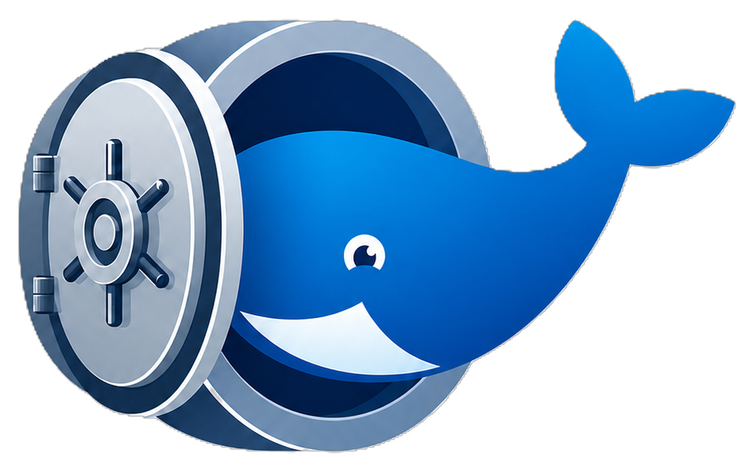
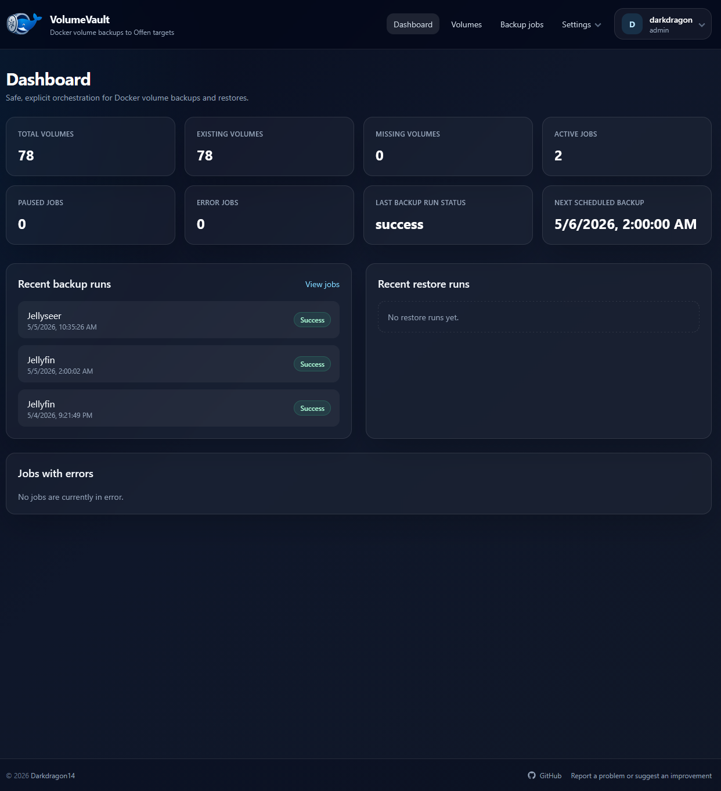
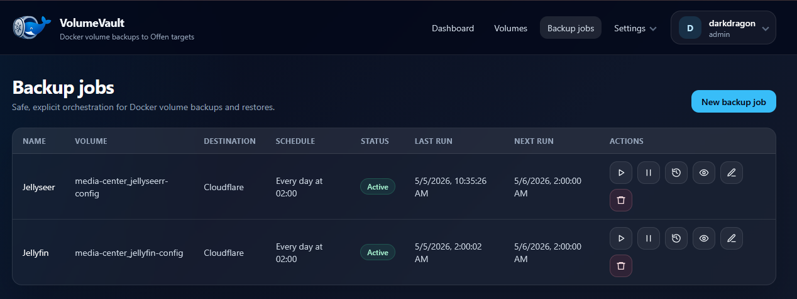

<p align="center">
  
</p>

# VolumeVault

[](https://github.com/Darkdragon14/VolumeVault/actions/workflows/tests.yml)
[](https://github.com/darkdragon14/VolumeVault/actions/workflows/ghcr.yml)
[](https://github.com/darkdragon14/VolumeVault/releases)
[](https://www.php.net/)
[](composer.json)

VolumeVault is a self-hosted Laravel application for managing Docker volume and host path backups with safe restores through [`offen/docker-volume-backup`](https://github.com/offen/docker-volume-backup).

It provides a clear web UI for scheduled backups, stack-level volume coverage, restore runs, encrypted destinations, notifications, proactive alerts, run history, onboarding, and API-driven automation.

<table>
  <tr>
    <td align="center" width="50%">
      
    </td>
    <td align="center" width="50%">
      
    </td>
  </tr>
</table>

## Get Started

Generate an application key first:

```bash
docker run --rm ghcr.io/darkdragon14/volumevault:latest php artisan key:generate --show
```

Create a `docker-compose.yml` file and paste the generated key in `APP_KEY`:

```yaml
services:
  volumevault:
    image: ghcr.io/darkdragon14/volumevault:latest
    ports:
      - "8080:8080"
    volumes:
      - volumevault_data:/app/storage
      - /var/run/docker.sock:/var/run/docker.sock
    environment:
      APP_KEY: base64:paste-generated-key-here
    restart: unless-stopped

volumes:
  volumevault_data:
```

Start VolumeVault:

```bash
docker compose up -d
```

Open `http://localhost:8080` and create the first administrator account from the onboarding screen.

The container listens on port `8080`; change the host side of the mapping, for example `9090:8080`, if you want to expose VolumeVault on another port.

The single container runs nginx, PHP-FPM, database migrations, queue worker, and scheduler.

Defaults are built into the application for a production SQLite setup. Add environment variables only when you need to override them, for example `APP_URL`, `APP_TIMEZONE`, or SMTP settings.

You can also use `env_file: .env` for overrides, but do not reuse a development `.env` in production without review. Values such as `APP_ENV=local` or `APP_DEBUG=true` override the safe production defaults.

Host path backup jobs **and local backup destinations** are restricted by `VOLUMEVAULT_HOST_PATH_ALLOWLIST`, a comma-separated list of allowed Docker host path prefixes such as `/srv,/mnt/data`. This is **fail-closed**: when the variable is empty, host path sources and local destinations are refused entirely. Configure the prefixes you intend to back up to/from; paths outside them are rejected both when saved and again at run time (defending against a symlink swapped in afterwards).

### Backup destinations on a private IP (NAS, self-hosted S3/MinIO, LAN SFTP)

The requests VolumeVault makes **to a backup destination on your behalf** are guarded against SSRF, and this is **deny-by-default**: a destination host that resolves to a private, loopback or link-local address (including the cloud metadata endpoint `169.254.169.254`) is refused. In practice **this only matters when your destination sits on a private IP** — a cloud destination reached by a public URL (AWS S3, Backblaze, Dropbox, …) is never affected and needs no configuration.

The trigger is the **range of the resolved IP, not whether you typed an IP or a hostname**. A public IP — whether written directly (`http://203.0.113.10:9000`) or reached through a hostname — is never blocked; that is by design, because the point of SSRF protection is to stop the server being used to reach *internal* resources an attacker could not otherwise touch (a public address is something they could already request themselves). Conversely a hostname is blocked when it resolves to a private address (e.g. an internal DNS name `nas.home.lan` → `192.168.1.x`).

What this changes for a destination on a private IP, **before** you allow its range:

- ✅ **Scheduled backups still run** — the upload is done by the backup container, which is not guarded, so the archive still lands on your NAS.
- ⚠️ The archive **size is not detected** (the run is still marked successful).
- ❌ **Restore is blocked** (listing + download) — this is the one that matters: a backup you cannot restore is useless.
- ❌ The **"Test destination"** button and the **storage-quota alert** are blocked.

The fix is a single line: list the CIDR range(s) your destinations live on in `VOLUMEVAULT_SSRF_ALLOWED_IPS` (comma-separated), after which everything works normally while `169.254.169.254` and friends stay blocked:

```env
# e.g. a NAS on your home LAN
VOLUMEVAULT_SSRF_ALLOWED_IPS=192.168.1.0/24
```

The host is resolved just before connecting, so a determined attacker controlling DNS could still rebind it afterwards — accepted here because every guarded action is admin-gated. Notification channels (Gotify, Ntfy, SMTP, …) are **not** guarded: they are blind, admin-configured, and commonly self-hosted on the LAN.

### Serving over HTTPS

When you serve VolumeVault over HTTPS (directly or behind a TLS-terminating reverse proxy), set `SESSION_SECURE_COOKIE=true` so the session cookie is only sent over HTTPS. **Leave it off for plain-HTTP or LAN-only access** — a `Secure` cookie is never sent over plain HTTP, so enabling it without TLS breaks login. Behind a reverse proxy, this works once `TRUSTED_PROXIES` is set and the proxy forwards `X-Forwarded-Proto: https` (see the docs for the full reverse-proxy setup).

Keep your `APP_KEY` safe: it is required to decrypt destinations, notifications, and installation saves.

## Documentation

The full documentation is published with GitHub Pages and built from the [`docs`](docs) directory.

- Documentation URL: [https://darkdragon14.github.io/VolumeVault/](https://darkdragon14.github.io/VolumeVault/)
- Documentation source: [`docs/index.md`](docs/index.md)

## Credits

VolumeVault relies on [`offen/docker-volume-backup`](https://github.com/offen/docker-volume-backup) for the actual Docker volume backup engine and destination support.

Huge thanks to Offen and the maintainers of `offen/docker-volume-backup` for their work.

## Contributing

All contributions are welcome.

- Contributor acknowledgements: [`CONTRIBUTORS.md`](CONTRIBUTORS.md)
